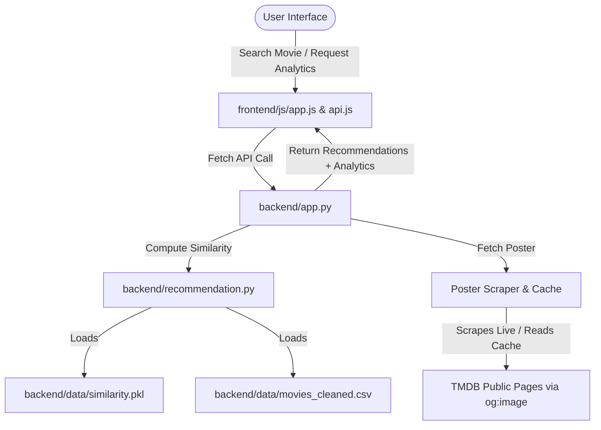

# 🎬 MovieMind AI — Movie Recommendation & Analytics Platform

MovieMind AI is a full-stack movie recommendation and analytics dashboard. Utilizing a custom **Machine Learning Cosine Similarity** engine trained on the TMDB 5000 movie dataset, it provides instant, highly relevant movie recommendations alongside real-time poster scraping and comprehensive data analytics.

---

## 🚀 Key Features

*   **🧠 Cosine Similarity Recommendation Engine**: Machine learning model analyzing movie features (genres, keywords, cast, crew, and overview) with Porter Stemming and Count Vectorization to recommend similar movies.
*   **🔍 High-Fidelity Autocomplete Search**: Real-time autocomplete suggestions on the client-side as you type, making movie searches seamless.
*   **🖼️ Live Poster Scraper & Dynamic Cache**: Key-free web scraper fetching high-resolution movie posters directly from TMDB's public Open Graph tags with localized dynamic caching for fast loading.
*   **📊 Rich Analytics Dashboard**: Beautiful dark-theme interactive visualizations built with Chart.js:
    *   *Genre Distribution* (Horizontal Bar Chart)
    *   *Top Rated Masterpieces* (Polar Area Chart)
    *   *Popularity vs Rating* (Scatter Chart)
    *   *Yearly Release Trends* (Spline Area Chart)
*   **📱 Cinematic Dark UI**: Responsive, glassmorphic dark-theme UI with card scale-up animations, custom scrollbars, and detailed movie modal overlays.

---

## 🏗️ System Architecture



---

## 📁 Project Structure

```text
movie-recommendation-dashboard/
│
├── backend/
│   ├── app.py                  # Core Flask server (API endpoints & page routing)
│   ├── train.py                # ML pipeline script (Preprocessing & Vectorization)
│   ├── recommendation.py       # Recommendation engine logic
│   │
│   ├── notebooks/
│   │   └── moviemind.ipynb     # Exploratory analysis and training playground
│   │
│   └── data/
│       ├── movies.csv          # Raw TMDB dataset
│       ├── credits.csv         # Raw TMDB credits dataset
│       ├── movies_cleaned.csv  # Processed dataset (Git-ignored, generated by train.py)
│       └── similarity.pkl      # Similarity matrix (Git-ignored, generated by train.py)
│
├── frontend/
│   ├── index.html              # Cinematic Landing Page
│   ├── dashboard.html          # Main Dashboard & Analytics Panel
│   │
│   ├── css/
│   │   └── style.css           # Premium Netflix-dark CSS theme
│   │
│   └── js/
│       ├── api.js              # Backend API communicator
│       └── app.js              # Application state and Chart.js controller
│
├── README.md                   # Project documentation
└── .gitignore                  # Git exclude configurations
```

---

## ⚙️ Quick Start Guide

### 1. Set Up Virtual Environment

Open your terminal and run:
```bash
# Create virtual environment
python -m venv venv

# Activate virtual environment (Windows PowerShell)
.\venv\Scripts\Activate.ps1

# Install dependencies
pip install -r requirements.txt
```

### 2. Preprocess Data and Train ML Model

To generate the cleaned dataset and the similarity matrix:
```bash
python backend/train.py
```
This runs the feature engineering pipeline, Porter Stemming, and Cosine Similarity calculation, generating `movies_cleaned.csv` and `similarity.pkl` in the `backend/data/` folder.

### 3. Run the Flask Web Application

Start the Flask server:
```bash
python backend/app.py
```
Open your browser and navigate to **`http://127.0.0.1:5000`** to experience **MovieMind AI**!

---

## 🎨 Design Aesthetics & Interface

*   **Dark Mode Obsidian Theme**: Deep charcoal backgrounds with glassmorphism panels.
*   **Vibrant Color Highlights**: Cinematic Netflix-red elements, glow effects, and smooth cards transition.
*   **Fully Responsive**: Adaptable grid layouts tailored for mobile, tablet, and widescreen layouts.
